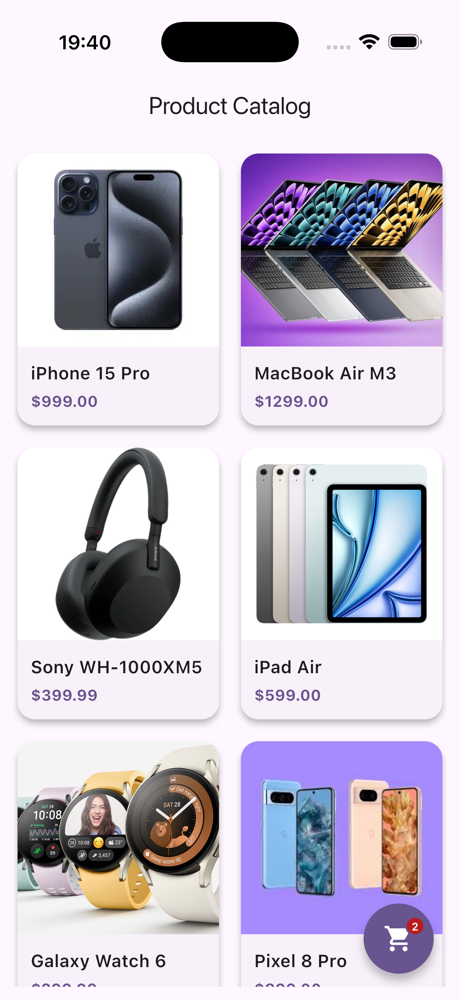
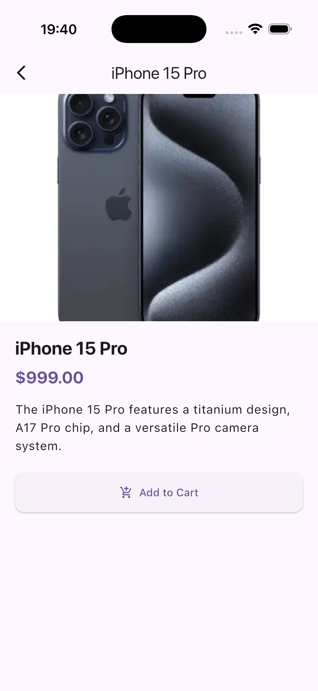

# Product Catalog

A beginner-friendly Flutter application that demonstrates fundamental Flutter concepts: widgets, navigation, UI design, data modeling, list/grid rendering, and basic state management.

## Features

- Browse products in a beautiful grid layout.
- Tap a product to view detailed information.
- Add products to a shopping cart with quantity controls and a full cart screen.
- Smooth Hero animations between the product list and detail screens.
- Clean, multi-file project structure with separated concerns.

## Folder Structure

```
lib/
├── main.dart
├── models/
│   └── product.dart
├── data/
│   └── products.dart
├── screens/
│   ├── home_screen.dart
│   └── product_detail_screen.dart
└── widgets/
    └── product_card.dart
```

## Flutter Version Requirements

- Flutter 3.10 or higher
- Dart 3.0 or higher (null safety enabled)

## Installation

1. Ensure Flutter is installed: https://docs.flutter.dev/get-started/install
2. Clone or copy this project.
3. Run the following command in the project root to fetch dependencies:

```bash
flutter pub get
```

## Running the App

Connect a device or start an emulator, then run:

```bash
flutter run
```

To run for a specific platform:

```bash
flutter run -d android
flutter run -d ios
```

## Running Tests

```bash
flutter test
```

## Screenshots

| Home Screen | Product Detail |
|-------------|----------------|
|  |  |
